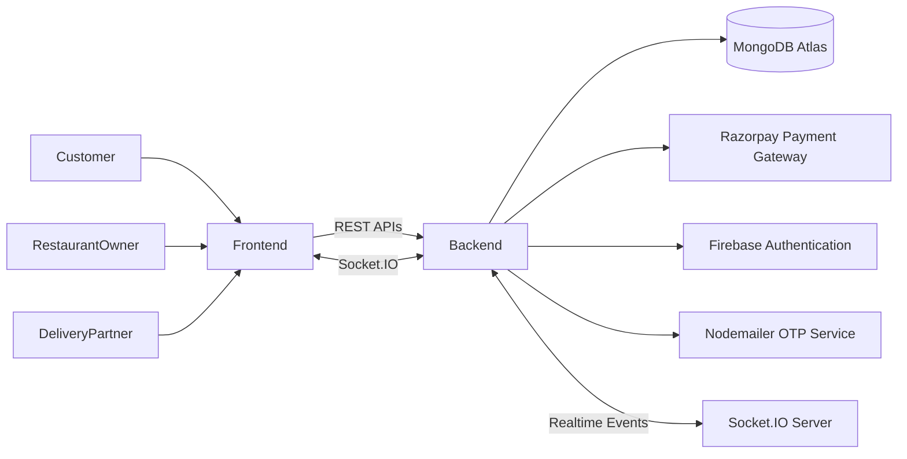
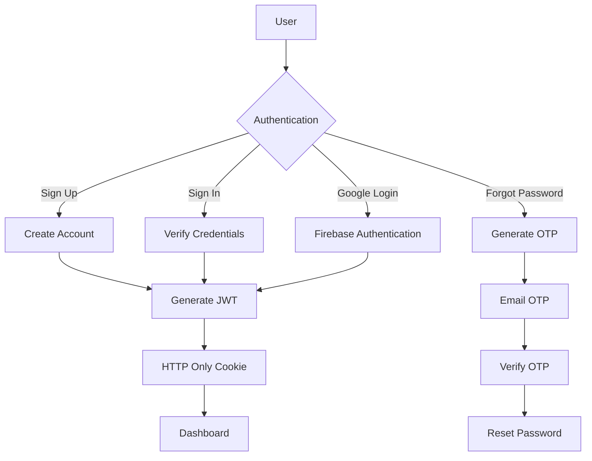
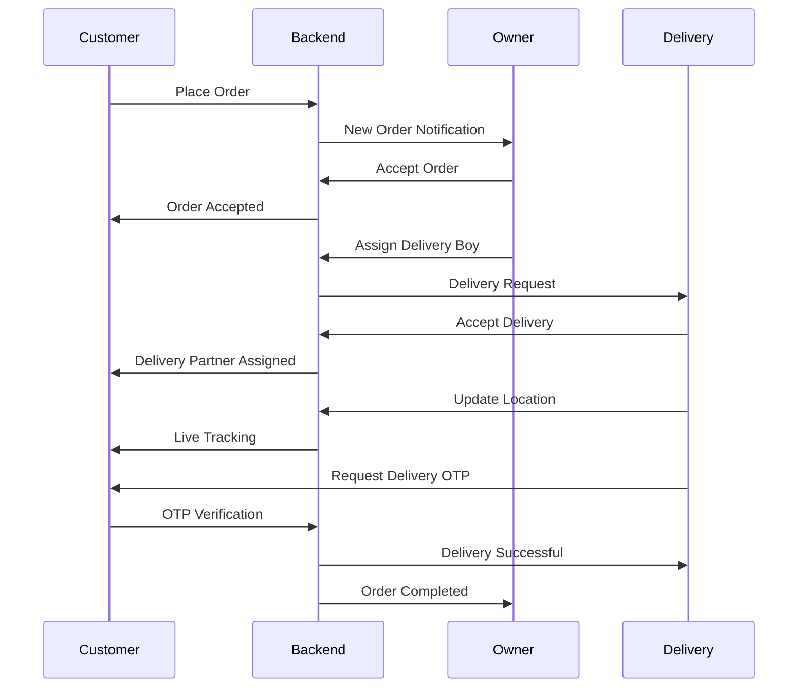
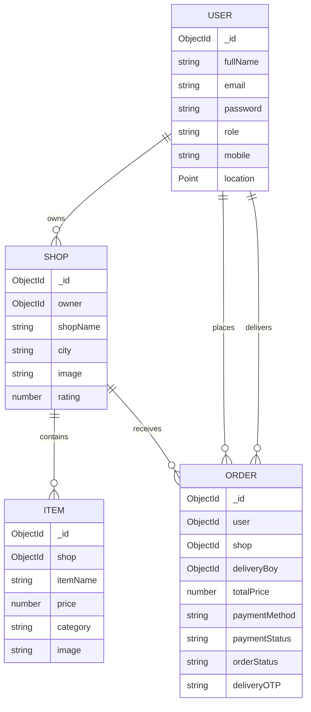

<div align="center">

# 🍔 Foodyy

### A Production-Inspired Real-Time Food Delivery Platform

Build • Order • Deliver • Track — All in Real-Time

[]()
[]()
[]()
[]()
[]()
[]()
[]()
[]()

🌐 **Live Demo**

https://foodyy-nt8z.onrender.com

</div>

---

# 📖 About The Project

Foodyy is a **production-inspired full-stack food delivery platform** built using the **MERN Stack**. The project simulates how modern food delivery applications work by connecting **Customers**, **Restaurant Owners**, and **Delivery Partners** in a single real-time ecosystem.

Unlike a traditional CRUD application, Foodyy focuses on solving real-world challenges such as secure authentication, restaurant management, online payments, live order processing, delivery assignment, OTP-based delivery verification, real-time tracking, and role-based dashboards.

The entire platform is designed with scalability, modularity, and user experience in mind.


---

# ✨ Highlights

- 🔐 JWT Authentication
- 🔑 Google Authentication
- 📧 Forgot Password using Email OTP
- 🍽️ Restaurant Management
- 🛒 Smart Shopping Cart
- 💳 Razorpay Payment Integration
- 💵 Cash on Delivery
- 📍 Live Location Tracking
- 🚴 Delivery Partner Dashboard
- 🏪 Restaurant Owner Dashboard
- 📦 Live Order Tracking
- 🔄 Real-Time Order Updates
- ⚡ Socket.IO Integration
- 📱 Responsive Design
- 🔒 HTTP Only Cookie Authentication

---

# 👥 User Roles

Foodyy provides three different dashboards based on user roles.

---

## 👤 Customer

The customer can

- Create an account
- Login using Email & Password
- Login using Google Authentication
- Reset password using Email OTP
- Detect current location automatically
- Search restaurants
- Search food items
- Browse restaurant menus
- Add products to cart
- Remove products from cart
- Update quantity
- Place orders
- Pay using Razorpay
- Choose Cash on Delivery
- Track live orders
- View order history
- Verify delivery using OTP

---

## 🏪 Restaurant Owner

Restaurant owners can completely manage their restaurants.

Features include

- Create Restaurant
- Upload Restaurant Images
- Edit Restaurant Details
- Add Food Items
- Upload Food Images
- Update Prices
- Manage Complete Menu
- Receive Orders in Real-Time
- Accept Orders
- Reject Orders
- Assign Delivery Partners
- Track Current Orders
- View Order History

---

## 🚴 Delivery Partner

Delivery partners receive and deliver orders.

Features include

- Dedicated Dashboard
- Receive Delivery Requests
- Accept Orders
- Live Delivery Updates
- Current Delivery Status
- Live Earnings Dashboard
- Customer Location
- OTP Verification before Delivery
- Delivery History

---

# 🚀 Core Features

## 🔐 Authentication

- JWT Authentication
- HTTP Only Cookies
- Google Authentication
- Email OTP Verification
- Forgot Password
- Password Reset
- Secure Password Hashing using bcrypt

---

## 🍔 Food Ordering

- Browse Restaurants
- Search Food
- View Restaurant Menu
- Smart Cart
- Quantity Management
- Checkout
- Multiple Payment Options
- Order Confirmation

---

## 💳 Payment System

Foodyy supports two payment methods.

- Cash on Delivery
- Razorpay Online Payment

Each online payment is verified securely from the backend before confirming the order.

---

## 📦 Order Management

Customers can

- Place Orders
- Track Orders
- View Previous Orders
- Receive Live Status Updates

Restaurant Owners can

- Receive Orders
- Process Orders
- Assign Delivery Partners

Delivery Partners can

- Accept Deliveries
- Deliver Orders
- Verify Customer OTP
- Complete Deliveries

---

## ⚡ Real-Time Features

Foodyy uses **Socket.IO** extensively.

Real-time functionalities include

- Live Order Notifications
- Live Status Updates
- Restaurant Notifications
- Delivery Acceptance
- Live Delivery Tracking
- Instant Dashboard Updates

---

## 📍 Location Features

- Browser Geolocation
- Reverse Geocoding
- Nearby Restaurants
- Live Delivery Location
- Delivery Partner Tracking

---

# 🛠 Tech Stack

## Frontend

- React.js
- Redux Toolkit
- React Router DOM
- Tailwind CSS
- Axios
- Socket.IO Client
- Firebase Authentication

---

## Backend

- Node.js
- Express.js
- MongoDB Atlas
- Mongoose
- JWT
- bcrypt
- Nodemailer
- Razorpay
- Socket.IO
- Cookie Parser

---

## Deployment

- Render
- MongoDB Atlas

---

# 📂 Project Structure

```
Foodyy
│
├── backend
│   ├── config
│   ├── controllers
│   ├── middleware
│   ├── models
│   ├── routes
│   ├── socket.js
│   └── index.js
│
├── frontend
│   ├── assets
│   ├── components
│   ├── hooks
│   ├── pages
│   ├── redux
│   ├── App.jsx
│   └── main.jsx
│
└── README.md
```

---

# 🎯 Why Foodyy?

Foodyy was built to understand how modern food delivery platforms work beyond simple CRUD operations.

This project combines

- Authentication
- Authorization
- Payment Gateway
- Real-Time Communication
- Location Services
- OTP Verification
- Role-Based Access Control
- Socket Programming
- State Management
- Cloud Deployment

into a single scalable application.

---

# 📸 Project Preview

# 📸 Application Preview

---

## 🎥 Project Demo

> Complete walkthrough of the application.

📹 **Demo Video / GIF**

---

## 🔐 Authentication

Secure authentication using JWT, Google Authentication and Email OTP.

### Screenshots

- Login Page
- 

- Signup Page
- 

- Forgot Password
- 

- OTP Verification
- 

- Google Authentication

---

## 👤 Customer Dashboard

The customer dashboard displays nearby restaurants, featured dishes, current location and personalized recommendations.

### Screenshots

- Customer Dashboard
- 

- Home Page
- Current Location
- Featured Restaurants

---

## 🔍 Smart Search

Search restaurants and food items instantly.

### Screenshots

- Search Bar
- Search Results

---

## 🍽 Restaurant Details

Browse restaurant information, ratings and complete food menu.

### Screenshots

- Restaurant Details
- Restaurant Rating
- Restaurant Information

---

## 🍔 Food Menu

Explore all available food items before placing an order.

### Screenshots

- Food Menu
- Food Categories
- Food Details

---

## 🛒 Shopping Cart

Manage selected food items before checkout.

### Features

- Add Item
- Remove Item
- Update Quantity
- Total Bill

### Screenshots

- Cart Page
- Cart Summary

---

## 💳 Checkout & Payment

Secure payment system with Cash on Delivery and Razorpay.

### Screenshots

- Checkout Page
- Address Selection
- Razorpay Payment
- Payment Success

---

## 📦 Order Tracking

Track every stage of your order in real time.

### Screenshots

- Order Status
- Live Tracking
- Delivery Status

---

## 📜 Order History

View previously placed orders.

### Screenshots

- Customer Order History

---

# 🏪 Restaurant Owner Dashboard

Restaurant owners have complete control over restaurant management.

---

## 🏪 Owner Dashboard

### Screenshots

- Owner Dashboard

---

## ➕ Create Restaurant

### Screenshots

- Create Restaurant

---

## ✏️ Edit Restaurant

### Screenshots

- Edit Restaurant Details

---

## 🍕 Add Food Items

### Screenshots

- Add Food Item

---

## 📝 Edit Food Items

### Screenshots

- Edit Food Item
- Change Price
- Update Food Images

---

## 📦 Manage Orders

### Screenshots

- Incoming Orders
- Processing Orders

---

## 🚴 Assign Delivery Partner

Assign available delivery partners to orders.

### Screenshots

- Delivery Assignment
- Available Delivery Partners

---

## 📜 Restaurant Order History

### Screenshots

- Owner Order History

---

# 🚴 Delivery Partner Dashboard

Dedicated dashboard for delivery partners.

---

## 🚴 Delivery Dashboard

### Screenshots

- Delivery Dashboard

---

## ✅ Accept Delivery Request

### Screenshots

- Incoming Delivery Request

---

## 📍 Live Location Tracking

Track delivery location in real time.

### Screenshots

- Live Map
- Current Location

---

## 💰 Earnings Dashboard

Track completed deliveries and total earnings.

### Screenshots

- Earnings Dashboard

---

## 🔐 Delivery OTP Verification

OTP verification before handing over the order.

### Screenshots

- OTP Screen
- OTP Verification Success

---

## 📜 Delivery History

### Screenshots

- Completed Deliveries

---

# ⚡ Real-Time Features

Powered by Socket.IO

### Screenshots

- Live Notifications
- Live Order Updates
- Live Delivery Tracking

---

# 📱 Responsive UI

Designed for Desktop, Tablet and Mobile devices.

### Screenshots

- Desktop View
- Tablet View
- Mobile View
# 🏗 System Architecture

The complete application follows a client-server architecture where different user roles communicate with a centralized backend. The backend manages authentication, restaurants, orders, payments, delivery assignment, real-time communication, and database operations.



---

# 🔐 Authentication Workflow

Authentication is secured using JWT Tokens stored in HTTP-only cookies.

Users can either create an account manually or login using Google Authentication.

Forgot password functionality is protected using Email OTP Verification.



---

# 🍔 Customer Workflow

The customer experiences the complete ordering journey from authentication to order delivery.

```mermaid
flowchart TD

Login

↓

Detect Current Location

↓

Fetch Nearby Restaurants

↓

Browse Restaurant

↓

Browse Menu

↓

Search Food

↓

Add To Cart

↓

Checkout

↓

Choose Payment

↓

Place Order

↓

Receive Live Status Updates

↓

Track Delivery

↓

OTP Verification

↓

Order Delivered

↓

Order History
```

---

# 🏪 Restaurant Owner Workflow

Restaurant owners manage restaurants and process customer orders.

```mermaid
flowchart TD

Owner Login

↓

Create Restaurant

↓

Upload Restaurant Image

↓

Add Food Items

↓

Upload Food Images

↓

Edit Prices

↓

Receive Orders

↓

Accept / Reject Orders

↓

Assign Delivery Partner

↓

Track Delivery

↓

Order Completed

↓

Order History
```

---

# 🚴 Delivery Partner Workflow

Delivery partners receive assigned deliveries and update order status in real time.

```mermaid
flowchart TD

Delivery Login

↓

Dashboard

↓

Receive Available Orders

↓

Accept Delivery

↓

Owner Receives Confirmation

↓

Pickup Food

↓

Navigate To Customer

↓

Live Location Tracking

↓

OTP Verification

↓

Delivery Completed

↓

Earnings Updated
```

---

# ⚡ Real-Time Order Lifecycle

Socket.IO is responsible for synchronizing all dashboards without requiring manual page refreshes.



---

# 💳 Payment Workflow

Foodyy supports two payment methods.

## Cash On Delivery

```mermaid
flowchart LR

Checkout

↓

Cash On Delivery

↓

Create Order

↓

Restaurant Receives Order

↓

Delivery

↓

OTP Verification

↓

Completed
```

---

## Razorpay Payment

```mermaid
flowchart TD

Checkout

↓

Create Razorpay Order

↓

Payment Gateway

↓

Payment Success

↓

Backend Verification

↓

Create Order

↓

Restaurant Receives Order

↓

Delivery Process
```

---

# 📍 Live Delivery Tracking

The application continuously synchronizes delivery information.

```mermaid
flowchart LR

Delivery Partner

↓

Current GPS Location

↓

Backend

↓

Socket.IO

↓

Customer Dashboard

↓

Live Map Tracking
```

---

# 🗄 Database ER Diagram



---

# 🔄 Overall Project Flow

```mermaid
flowchart TD

Authentication

↓

Customer Dashboard

↓

Restaurant Selection

↓

Food Selection

↓

Cart

↓

Checkout

↓

Payment

↓

Order Created

↓

Restaurant Owner

↓

Accept Order

↓

Assign Delivery Boy

↓

Delivery Accepted

↓

Live Tracking

↓

OTP Verification

↓

Order Delivered

↓

Order History Updated
```

---

# 📡 Real-Time Events

Foodyy uses Socket.IO for seamless communication between all users.

### Customer

- Live Order Status
- Delivery Tracking
- Order Notifications

### Restaurant Owner

- Incoming Orders
- Delivery Acceptance
- Order Completion

### Delivery Partner

- Assigned Orders
- Live Delivery Updates
- Dashboard Synchronization

---

# 🔒 Security Architecture

- JWT Authentication
- HTTP Only Cookies
- Password Hashing (bcrypt)
- Email OTP Verification
- Firebase Google Authentication
- Secure Razorpay Verification
- Role-Based Access Control
- Protected Backend Routes

---

# 🚀 Getting Started

Follow the steps below to run the project locally.

## 1️⃣ Clone the Repository

```bash
git clone https://github.com/NitishSrivastava1922/Foodyy.git
```

---

## 2️⃣ Navigate into the Project

```bash
cd Foodyy
```

---

## 3️⃣ Install Backend Dependencies

```bash
cd backend

npm install
```

---

## 4️⃣ Install Frontend Dependencies

```bash
cd ../frontend

npm install
```

---

## 5️⃣ Configure Environment Variables

### Backend (.env)

```env
PORT=

MONGO_URI=

JWT_SECRET=

EMAIL=

EMAIL_PASSWORD=

RAZORPAY_KEY_ID=

RAZORPAY_KEY_SECRET=

GOOGLE_API_KEY=
```

---

### Frontend (.env)

```env
VITE_BACKEND_URL=

VITE_FIREBASE_API_KEY=

VITE_FIREBASE_AUTH_DOMAIN=

VITE_FIREBASE_PROJECT_ID=

VITE_FIREBASE_STORAGE_BUCKET=

VITE_FIREBASE_MESSAGING_SENDER_ID=

VITE_FIREBASE_APP_ID=

VITE_RAZORPAY_KEY=
```

---

## 6️⃣ Run Backend

```bash
cd backend

npm run dev
```

---

## 7️⃣ Run Frontend

```bash
cd frontend

npm run dev
```

---

# 📡 REST APIs

## Authentication

| Method | Endpoint |
|----------|--------------------------|
| POST | /api/auth/signup |
| POST | /api/auth/signin |
| POST | /api/auth/google-auth |
| GET | /api/auth/signout |
| POST | /api/auth/send-otp |
| POST | /api/auth/verify-otp |
| POST | /api/auth/reset-password |

---

## User APIs

| Method | Endpoint |
|----------|--------------------------|
| GET | /api/user/current |
| POST | /api/user/update-location |

---

## Restaurant APIs

| Method | Endpoint |
|----------|--------------------------|
| POST | /api/shop/create |
| GET | /api/shop/get-all |
| GET | /api/shop/get-my |
| PUT | /api/shop/update |

---

## Food Item APIs

| Method | Endpoint |
|----------|--------------------------|
| POST | /api/item/create |
| GET | /api/item/all |
| GET | /api/item/search-items |
| PUT | /api/item/update |

---

## Order APIs

| Method | Endpoint |
|----------|--------------------------|
| POST | /api/order/create |
| GET | /api/order/my-orders |
| PUT | /api/order/update-status |
| PUT | /api/order/assign-delivery |
| POST | /api/order/verify-delivery |

---

# 📷 Project Screenshots

> Replace these placeholders with actual screenshots.

## 🔐 Authentication

| Login | Signup |
|--------|---------|
|  |  |

---

## 👤 Customer Dashboard


---

## 🍔 Restaurant Page


---

## 🛒 Shopping Cart


---

## 💳 Checkout


---

## 🏪 Restaurant Owner Dashboard


---

## 🚴 Delivery Partner Dashboard


---

## 📍 Live Order Tracking


---

## 📱 Mobile Responsive UI


---

# 🎥 Demo Video

A complete walkthrough of the project can be viewed here.

```
Coming Soon
```

---

# 🌐 Deployment

## Frontend

Render

```
https://foodyy-nt8z.onrender.com
```

---

## Backend

Render

```
https://foodyy-backend.onrender.com
```

---

# 💡 Future Improvements

The project can be further enhanced by adding

- AI Food Recommendation
- Restaurant Analytics Dashboard
- Coupon & Promo Code System
- Loyalty Reward Program
- Push Notifications
- Progressive Web App (PWA)
- Multi-language Support
- Dark Mode
- Voice Search
- Admin Analytics
- Rider Navigation Optimization
- Inventory Management
- Restaurant Review Moderation
- Customer Support Chatbot
- Delivery Heatmaps

---

# 🎯 Learning Outcomes

This project helped in understanding

- Production-level MERN Architecture
- REST API Design
- JWT Authentication
- HTTP Only Cookies
- Google OAuth
- OTP Verification
- Payment Gateway Integration
- Socket.IO
- Role-Based Authorization
- MongoDB Relationships
- Real-Time Applications
- Deployment on Render
- Responsive UI Development
- Redux Toolkit State Management

---

# 📊 Project Statistics

| Category | Details |
|------------|-----------------------------|
| User Roles | 3 |
| Authentication Methods | 2 |
| Payment Methods | 2 |
| OTP Verification | ✅ |
| Live Tracking | ✅ |
| Socket.IO Events | Multiple |
| Database | MongoDB Atlas |
| Frontend | React + Tailwind CSS |
| Backend | Node.js + Express |
| State Management | Redux Toolkit |

---

# 🤝 Contributing

Contributions are welcome.

1. Fork the repository

2. Create your feature branch

```bash
git checkout -b feature/NewFeature
```

3. Commit your changes

```bash
git commit -m "Added New Feature"
```

4. Push the branch

```bash
git push origin feature/NewFeature
```

5. Open a Pull Request

---

# 👨‍💻 Author

## Nitish Srivastava

**B.Tech Computer Science Engineering**

**Harcourt Butler Technical University (HBTU), Kanpur**

### Connect with me

- GitHub

```
https://github.com/NitishSrivastava1922
```

- LinkedIn

```
https://www.linkedin.com/in/nitish-srivastava-69850628a
```

---

# ⭐ Support

If you found this project useful, please consider giving it a ⭐ on GitHub.

It motivates me to build more production-level open-source projects.

---

# 📜 License

This project is licensed under the MIT License.

---

<div align="center">

## 🍔 Thank You for Visiting Foodyy

Built with ❤️ using the MERN Stack

⭐ Happy Coding ⭐

</div>
